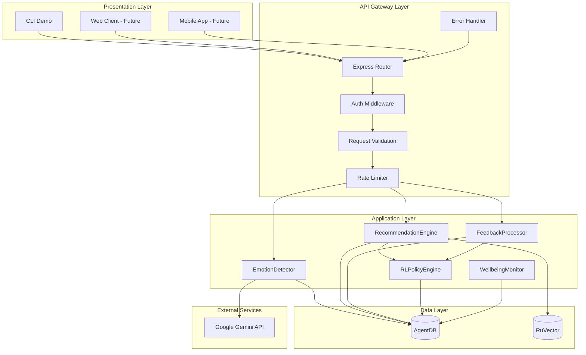
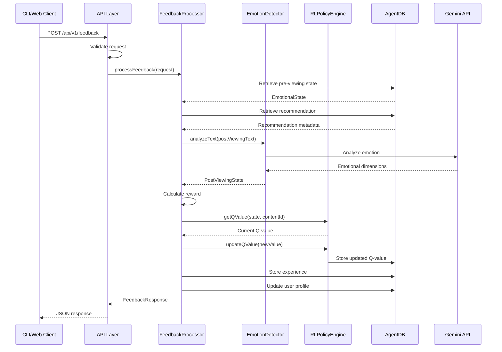
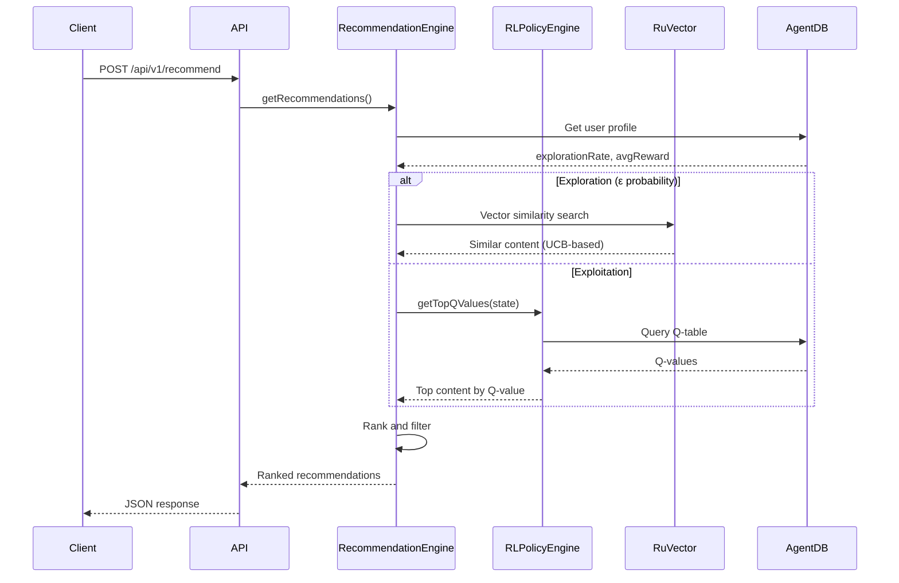

# EmotiStream Nexus - FeedbackReward Module & API/CLI Architecture

**SPARC Phase**: Architecture (Phase 3)
**Component**: FeedbackReward Module, REST API Layer, CLI Demo
**Version**: 1.0.0
**Date**: 2025-12-05

---

## Table of Contents

1. [Architecture Overview](#architecture-overview)
2. [Part 1: FeedbackReward Module](#part-1-feedbackreward-module)
3. [Part 2: API Layer](#part-2-api-layer)
4. [Part 3: CLI Demo](#part-3-cli-demo)
5. [Technology Stack](#technology-stack)
6. [Data Flow Diagrams](#data-flow-diagrams)
7. [Deployment Architecture](#deployment-architecture)
8. [Security Architecture](#security-architecture)
9. [Scalability & Performance](#scalability--performance)
10. [Testing Strategy](#testing-strategy)

---

## Architecture Overview

### High-Level System Architecture



### Component Interaction Matrix

| Component | Depends On | Provides To | Storage |
|-----------|-----------|-------------|---------|
| **FeedbackProcessor** | EmotionDetector, RLPolicyEngine | API Layer | AgentDB |
| **EmotionDetector** | Gemini API | All modules | AgentDB |
| **RLPolicyEngine** | AgentDB, RuVector | RecommendationEngine | AgentDB |
| **RecommendationEngine** | RLPolicyEngine, RuVector | API Layer | AgentDB |
| **API Layer** | All application modules | CLI, Web, Mobile | - |
| **CLI Demo** | API Layer | End users | - |

---

## Part 1: FeedbackReward Module

### 1.1 Module Structure

```
src/feedback/
├── index.ts                    # Public exports
├── processor.ts                # FeedbackProcessor class
├── reward-calculator.ts        # Multi-factor reward calculation
├── experience-store.ts         # Experience persistence
├── user-profile.ts             # User profile updates
├── types.ts                    # Module-specific types
└── __tests__/                  # Unit tests
    ├── processor.test.ts
    ├── reward-calculator.test.ts
    └── experience-store.test.ts
```

### 1.2 TypeScript Interfaces

```typescript
// src/feedback/types.ts

/**
 * Feedback request from API layer
 */
export interface FeedbackRequest {
  userId: string;
  contentId: string;
  emotionalStateId: string;
  postViewingState: PostViewingState;
  viewingDetails?: ViewingDetails;
}

/**
 * Post-viewing emotional state (supports multiple input types)
 */
export interface PostViewingState {
  text?: string;                     // Free-form text feedback
  explicitRating?: number;            // 1-5 star rating
  explicitEmoji?: string;             // Emoji feedback
}

/**
 * Viewing behavior details
 */
export interface ViewingDetails {
  completionRate: number;             // 0.0-1.0 (percentage watched)
  durationSeconds: number;            // Total viewing time
  pauseCount?: number;                // Number of pauses
  skipCount?: number;                 // Number of skips
}

/**
 * Feedback response to API layer
 */
export interface FeedbackResponse {
  experienceId: string;
  reward: number;                     // -1.0 to 1.0
  emotionalImprovement: number;       // Distance moved toward target
  qValueBefore: number;
  qValueAfter: number;
  policyUpdated: boolean;
  message: string;                    // User-friendly feedback
  insights: FeedbackInsights;
}

/**
 * Detailed feedback insights for analytics
 */
export interface FeedbackInsights {
  directionAlignment: number;         // Cosine similarity (-1 to 1)
  magnitudeScore: number;             // Improvement magnitude (0-1)
  proximityBonus: number;             // Bonus for reaching target (0-0.2)
  completionBonus: number;            // Viewing behavior bonus (-0.2 to 0.2)
}

/**
 * Emotional state vector
 */
export interface EmotionalState {
  valence: number;                    // -1.0 to 1.0
  arousal: number;                    // -1.0 to 1.0
  dominance: number;                  // -1.0 to 1.0 (optional)
  confidence: number;                 // 0.0 to 1.0
  timestamp: Date;
}

/**
 * Experience for RL training
 */
export interface EmotionalExperience {
  experienceId: string;
  userId: string;
  contentId: string;
  stateBeforeId: string;
  stateAfter: EmotionalState;
  desiredState: EmotionalState;
  reward: number;
  qValueBefore: number;
  qValueAfter: number;
  timestamp: Date;
  metadata: Record<string, any>;
}

/**
 * User learning profile
 */
export interface UserProfile {
  userId: string;
  totalExperiences: number;
  avgReward: number;
  explorationRate: number;
  preferredGenres: string[];
  learningProgress: number;           // 0-100
}
```

### 1.3 FeedbackProcessor Class

```typescript
// src/feedback/processor.ts

import { EmotionDetector } from '../emotion';
import { RLPolicyEngine } from '../rl-policy';
import { ExperienceStore } from './experience-store';
import { RewardCalculator } from './reward-calculator';
import { UserProfileManager } from './user-profile';
import type {
  FeedbackRequest,
  FeedbackResponse,
  EmotionalState,
  EmotionalExperience,
} from './types';

/**
 * Main feedback processing class
 * Handles post-viewing feedback and updates RL policy
 */
export class FeedbackProcessor {
  private emotionDetector: EmotionDetector;
  private rlEngine: RLPolicyEngine;
  private experienceStore: ExperienceStore;
  private rewardCalculator: RewardCalculator;
  private profileManager: UserProfileManager;

  constructor(
    emotionDetector: EmotionDetector,
    rlEngine: RLPolicyEngine,
    experienceStore: ExperienceStore,
    rewardCalculator: RewardCalculator,
    profileManager: UserProfileManager
  ) {
    this.emotionDetector = emotionDetector;
    this.rlEngine = rlEngine;
    this.experienceStore = experienceStore;
    this.rewardCalculator = rewardCalculator;
    this.profileManager = profileManager;
  }

  /**
   * Process feedback and update RL policy
   * @throws {ValidationError} If request is invalid
   * @throws {NotFoundError} If state or recommendation not found
   * @throws {RLPolicyError} If Q-value update fails
   */
  async processFeedback(request: FeedbackRequest): Promise<FeedbackResponse> {
    // Step 1: Validate request
    this.validateRequest(request);

    // Step 2: Retrieve pre-viewing emotional state
    const stateBefore = await this.getEmotionalState(request.emotionalStateId);
    if (!stateBefore) {
      throw new NotFoundError('Pre-viewing state not found');
    }

    // Step 3: Get desired emotional state from recommendation
    const recommendation = await this.getRecommendation(
      request.userId,
      request.contentId
    );
    const desiredState = recommendation.targetEmotionalState;

    // Step 4: Analyze post-viewing emotional state
    const stateAfter = await this.analyzePostViewingState(
      request.postViewingState
    );

    // Step 5: Calculate multi-factor reward
    const baseReward = this.rewardCalculator.calculate(
      stateBefore,
      stateAfter,
      desiredState
    );

    // Step 6: Apply viewing behavior modifiers
    const completionBonus = request.viewingDetails
      ? this.rewardCalculator.calculateCompletionBonus(request.viewingDetails)
      : 0;

    const finalReward = this.clamp(baseReward + completionBonus, -1, 1);

    // Step 7: Get current Q-value
    const qValueBefore = await this.rlEngine.getQValue(
      stateBefore,
      request.contentId
    );

    // Step 8: Update Q-value using Q-learning update rule
    const qValueAfter = this.updateQValue(
      qValueBefore,
      finalReward,
      stateBefore,
      request.contentId
    );

    // Step 9: Store experience for replay learning
    const experienceId = this.generateExperienceId();
    const experience: EmotionalExperience = {
      experienceId,
      userId: request.userId,
      contentId: request.contentId,
      stateBeforeId: request.emotionalStateId,
      stateAfter,
      desiredState,
      reward: finalReward,
      qValueBefore,
      qValueAfter,
      timestamp: new Date(),
      metadata: {
        viewingDetails: request.viewingDetails,
        feedbackType: this.determineFeedbackType(request.postViewingState),
      },
    };

    await this.experienceStore.store(experience);

    // Step 10: Update user profile
    await this.profileManager.update(request.userId, finalReward);

    // Step 11: Calculate emotional improvement
    const emotionalImprovement = this.calculateEmotionalImprovement(
      stateBefore,
      stateAfter,
      desiredState
    );

    // Step 12: Generate user-friendly message
    const message = this.generateFeedbackMessage(finalReward, emotionalImprovement);

    // Step 13: Compile detailed insights
    const insights = this.rewardCalculator.calculateInsights(
      stateBefore,
      stateAfter,
      desiredState,
      completionBonus
    );

    // Step 14: Return comprehensive response
    return {
      experienceId,
      reward: finalReward,
      emotionalImprovement,
      qValueBefore,
      qValueAfter,
      policyUpdated: true,
      message,
      insights,
    };
  }

  /**
   * Analyze post-viewing state from various input types
   */
  private async analyzePostViewingState(
    postViewingState: PostViewingState
  ): Promise<EmotionalState> {
    if (postViewingState.text) {
      // Text-based feedback (most accurate)
      return await this.emotionDetector.analyzeText(postViewingState.text);
    } else if (postViewingState.explicitRating !== undefined) {
      // Explicit rating (less granular)
      return this.convertExplicitRating(postViewingState.explicitRating);
    } else if (postViewingState.explicitEmoji) {
      // Emoji feedback (least granular)
      return this.convertEmojiToState(postViewingState.explicitEmoji);
    } else {
      throw new ValidationError('No post-viewing feedback provided');
    }
  }

  /**
   * Update Q-value using Q-learning algorithm
   * Q(s,a) ← Q(s,a) + α[r + γ max Q(s',a') - Q(s,a)]
   * For terminal state (post-viewing), γ max Q(s',a') = 0
   */
  private updateQValue(
    currentQ: number,
    reward: number,
    state: EmotionalState,
    contentId: string
  ): number {
    const LEARNING_RATE = 0.1;
    const newQ = currentQ + LEARNING_RATE * (reward - currentQ);

    // Asynchronously update in background
    this.rlEngine.updateQValue(state, contentId, newQ).catch((err) => {
      console.error('Q-value update failed:', err);
    });

    return newQ;
  }

  /**
   * Convert explicit rating (1-5 stars) to emotional state
   */
  private convertExplicitRating(rating: number): EmotionalState {
    const mappings: Record<number, EmotionalState> = {
      1: { valence: -0.8, arousal: 0.3, dominance: -0.3, confidence: 0.6, timestamp: new Date() },
      2: { valence: -0.4, arousal: 0.1, dominance: -0.1, confidence: 0.6, timestamp: new Date() },
      3: { valence: 0.0, arousal: 0.0, dominance: 0.0, confidence: 0.6, timestamp: new Date() },
      4: { valence: 0.4, arousal: -0.1, dominance: 0.1, confidence: 0.6, timestamp: new Date() },
      5: { valence: 0.8, arousal: -0.2, dominance: 0.2, confidence: 0.6, timestamp: new Date() },
    };

    return mappings[rating] || mappings[3];
  }

  /**
   * Convert emoji to emotional state
   */
  private convertEmojiToState(emoji: string): EmotionalState {
    const emojiMappings: Record<string, EmotionalState> = {
      '😊': { valence: 0.7, arousal: -0.2, dominance: 0.2, confidence: 0.5, timestamp: new Date() },
      '😄': { valence: 0.8, arousal: 0.3, dominance: 0.3, confidence: 0.5, timestamp: new Date() },
      '😢': { valence: -0.6, arousal: -0.3, dominance: -0.4, confidence: 0.5, timestamp: new Date() },
      '😭': { valence: -0.8, arousal: 0.2, dominance: -0.5, confidence: 0.5, timestamp: new Date() },
      '😡': { valence: -0.7, arousal: 0.8, dominance: 0.4, confidence: 0.5, timestamp: new Date() },
      '😌': { valence: 0.5, arousal: -0.6, dominance: 0.1, confidence: 0.5, timestamp: new Date() },
      '😴': { valence: 0.2, arousal: -0.8, dominance: -0.3, confidence: 0.5, timestamp: new Date() },
      '😐': { valence: 0.0, arousal: 0.0, dominance: 0.0, confidence: 0.5, timestamp: new Date() },
      '👍': { valence: 0.6, arousal: 0.1, dominance: 0.2, confidence: 0.5, timestamp: new Date() },
      '👎': { valence: -0.6, arousal: 0.1, dominance: -0.2, confidence: 0.5, timestamp: new Date() },
      '❤️': { valence: 0.9, arousal: 0.2, dominance: 0.3, confidence: 0.5, timestamp: new Date() },
      '💔': { valence: -0.8, arousal: 0.3, dominance: -0.4, confidence: 0.5, timestamp: new Date() },
    };

    return emojiMappings[emoji] || {
      valence: 0.0,
      arousal: 0.0,
      dominance: 0.0,
      confidence: 0.3,
      timestamp: new Date(),
    };
  }

  /**
   * Calculate emotional improvement metric
   */
  private calculateEmotionalImprovement(
    stateBefore: EmotionalState,
    stateAfter: EmotionalState,
    desiredState: EmotionalState
  ): number {
    // Calculate distance before viewing
    const distanceBefore = Math.sqrt(
      Math.pow(stateBefore.valence - desiredState.valence, 2) +
      Math.pow(stateBefore.arousal - desiredState.arousal, 2)
    );

    // Calculate distance after viewing
    const distanceAfter = Math.sqrt(
      Math.pow(stateAfter.valence - desiredState.valence, 2) +
      Math.pow(stateAfter.arousal - desiredState.arousal, 2)
    );

    // Calculate improvement (reduction in distance)
    if (distanceBefore === 0) {
      return 1.0; // Already at target state
    }

    const improvement = (distanceBefore - distanceAfter) / distanceBefore;
    return Math.max(0, Math.min(1, improvement));
  }

  /**
   * Generate user-friendly feedback message
   */
  private generateFeedbackMessage(reward: number, improvement: number): string {
    if (reward > 0.7) {
      const messages = [
        'Excellent choice! This content really helped improve your mood. 🎯',
        'Perfect match! You\'re moving in exactly the right direction. ✨',
        'Great feedback! We\'re learning what works best for you. 🌟',
      ];
      return messages[Math.floor(Math.random() * messages.length)];
    } else if (reward > 0.4) {
      const messages = [
        'Good choice! Your recommendations are getting better. 👍',
        'Nice improvement! We\'re fine-tuning your preferences. 📈',
        'Solid match! Your content selection is improving. ✓',
      ];
      return messages[Math.floor(Math.random() * messages.length)];
    } else if (reward > 0.1) {
      const messages = [
        'Thanks for the feedback. We\'re learning your preferences. 📊',
        'Noted! This helps us understand what you enjoy. 💡',
        'Feedback received. We\'ll adjust future recommendations. 🔄',
      ];
      return messages[Math.floor(Math.random() * messages.length)];
    } else if (reward > -0.3) {
      const messages = [
        'We\'re still learning. Next time will be better! 🎯',
        'Thanks for letting us know. We\'ll improve! 📈',
        'Feedback noted. We\'re adjusting our approach. 🔧',
      ];
      return messages[Math.floor(Math.random() * messages.length)];
    } else {
      const messages = [
        'Sorry this wasn\'t a great match. We\'ll do better next time! 🎯',
        'We\'re learning from this. Future recommendations will improve! 💪',
        'Thanks for the honest feedback. We\'ll adjust significantly! 🔄',
      ];
      return messages[Math.floor(Math.random() * messages.length)];
    }
  }

  // Helper methods
  private validateRequest(request: FeedbackRequest): void {
    if (!request.userId || !request.contentId || !request.emotionalStateId) {
      throw new ValidationError('Missing required fields');
    }

    const hasText = !!request.postViewingState.text;
    const hasRating = request.postViewingState.explicitRating !== undefined;
    const hasEmoji = !!request.postViewingState.explicitEmoji;

    if (!hasText && !hasRating && !hasEmoji) {
      throw new ValidationError('No post-viewing feedback provided');
    }

    if (hasRating) {
      const rating = request.postViewingState.explicitRating!;
      if (rating < 1 || rating > 5) {
        throw new ValidationError('Rating must be between 1 and 5');
      }
    }

    if (request.viewingDetails) {
      const rate = request.viewingDetails.completionRate;
      if (rate < 0 || rate > 1) {
        throw new ValidationError('Completion rate must be between 0 and 1');
      }
    }
  }

  private clamp(value: number, min: number, max: number): number {
    return Math.max(min, Math.min(max, value));
  }

  private generateExperienceId(): string {
    return `exp_${Date.now()}_${Math.random().toString(36).substr(2, 9)}`;
  }

  private determineFeedbackType(postViewingState: PostViewingState): string {
    if (postViewingState.text) return 'text';
    if (postViewingState.explicitRating !== undefined) return 'rating';
    if (postViewingState.explicitEmoji) return 'emoji';
    return 'unknown';
  }

  private async getEmotionalState(stateId: string): Promise<EmotionalState | null> {
    // Implementation in EmotionalStateStore
    return null; // Placeholder
  }

  private async getRecommendation(userId: string, contentId: string): Promise<any> {
    // Implementation in RecommendationStore
    return null; // Placeholder
  }
}
```

### 1.4 Reward Calculator

```typescript
// src/feedback/reward-calculator.ts

import type { EmotionalState, FeedbackInsights, ViewingDetails } from './types';

/**
 * Multi-factor reward calculation
 *
 * Reward = (Direction * 0.6) + (Magnitude * 0.4) + ProximityBonus
 *
 * - Direction: Cosine similarity between actual and desired emotional change
 * - Magnitude: Size of emotional improvement
 * - Proximity: Bonus for getting close to target (up to +0.2)
 */
export class RewardCalculator {
  private readonly DIRECTION_WEIGHT = 0.6;
  private readonly MAGNITUDE_WEIGHT = 0.4;
  private readonly MAX_PROXIMITY_BONUS = 0.2;
  private readonly NORMALIZATION_FACTOR = 2.0;

  /**
   * Calculate reward based on emotional state changes
   */
  calculate(
    stateBefore: EmotionalState,
    stateAfter: EmotionalState,
    desiredState: EmotionalState
  ): number {
    // Component 1: Direction Alignment (60% weight)
    const directionAlignment = this.calculateDirectionAlignment(
      stateBefore,
      stateAfter,
      desiredState
    );

    // Component 2: Improvement Magnitude (40% weight)
    const magnitudeScore = this.calculateMagnitude(stateBefore, stateAfter);

    // Component 3: Proximity Bonus (up to +0.2)
    const proximityBonus = this.calculateProximityBonus(stateAfter, desiredState);

    // Final reward calculation
    const baseReward =
      directionAlignment * this.DIRECTION_WEIGHT +
      magnitudeScore * this.MAGNITUDE_WEIGHT;

    const finalReward = baseReward + proximityBonus;

    // Clamp to valid range
    return this.clamp(finalReward, -1, 1);
  }

  /**
   * Calculate direction alignment using cosine similarity
   */
  private calculateDirectionAlignment(
    stateBefore: EmotionalState,
    stateAfter: EmotionalState,
    desiredState: EmotionalState
  ): number {
    // Actual emotional change vector
    const actualDelta = {
      valence: stateAfter.valence - stateBefore.valence,
      arousal: stateAfter.arousal - stateBefore.arousal,
    };

    // Desired emotional change vector
    const desiredDelta = {
      valence: desiredState.valence - stateBefore.valence,
      arousal: desiredState.arousal - stateBefore.arousal,
    };

    // Cosine similarity: cos(θ) = (A·B) / (|A||B|)
    const dotProduct =
      actualDelta.valence * desiredDelta.valence +
      actualDelta.arousal * desiredDelta.arousal;

    const actualMagnitude = Math.sqrt(
      actualDelta.valence ** 2 + actualDelta.arousal ** 2
    );

    const desiredMagnitude = Math.sqrt(
      desiredDelta.valence ** 2 + desiredDelta.arousal ** 2
    );

    if (actualMagnitude === 0 || desiredMagnitude === 0) {
      return 0.0; // No change or no desired change
    }

    const alignment = dotProduct / (actualMagnitude * desiredMagnitude);
    return this.clamp(alignment, -1, 1);
  }

  /**
   * Calculate improvement magnitude
   */
  private calculateMagnitude(
    stateBefore: EmotionalState,
    stateAfter: EmotionalState
  ): number {
    const delta = {
      valence: stateAfter.valence - stateBefore.valence,
      arousal: stateAfter.arousal - stateBefore.arousal,
    };

    const magnitude = Math.sqrt(delta.valence ** 2 + delta.arousal ** 2);
    return Math.min(1.0, magnitude / this.NORMALIZATION_FACTOR);
  }

  /**
   * Calculate proximity bonus for reaching target state
   */
  private calculateProximityBonus(
    stateAfter: EmotionalState,
    desiredState: EmotionalState
  ): number {
    const distance = Math.sqrt(
      (stateAfter.valence - desiredState.valence) ** 2 +
      (stateAfter.arousal - desiredState.arousal) ** 2
    );

    return Math.max(0, this.MAX_PROXIMITY_BONUS * (1 - distance / 2));
  }

  /**
   * Calculate completion bonus from viewing behavior
   */
  calculateCompletionBonus(viewingDetails: ViewingDetails): number {
    const MAX_COMPLETION_BONUS = 0.2;
    const MIN_ACCEPTABLE_COMPLETION = 0.8;
    const PAUSE_PENALTY_FACTOR = 0.01;
    const SKIP_PENALTY_FACTOR = 0.02;

    let bonus = 0;

    // Completion rate bonus/penalty
    if (viewingDetails.completionRate >= MIN_ACCEPTABLE_COMPLETION) {
      bonus += MAX_COMPLETION_BONUS * viewingDetails.completionRate;
    } else if (viewingDetails.completionRate < 0.3) {
      bonus += -MAX_COMPLETION_BONUS * (1 - viewingDetails.completionRate);
    } else {
      bonus += -MAX_COMPLETION_BONUS * 0.5 * (1 - viewingDetails.completionRate);
    }

    // Pause count penalty
    if (viewingDetails.pauseCount !== undefined) {
      const pausePenalty = Math.min(0.1, viewingDetails.pauseCount * PAUSE_PENALTY_FACTOR);
      bonus -= pausePenalty;
    }

    // Skip count penalty
    if (viewingDetails.skipCount !== undefined) {
      const skipPenalty = Math.min(0.15, viewingDetails.skipCount * SKIP_PENALTY_FACTOR);
      bonus -= skipPenalty;
    }

    return this.clamp(bonus, -MAX_COMPLETION_BONUS, MAX_COMPLETION_BONUS);
  }

  /**
   * Calculate detailed insights for analytics
   */
  calculateInsights(
    stateBefore: EmotionalState,
    stateAfter: EmotionalState,
    desiredState: EmotionalState,
    completionBonus: number
  ): FeedbackInsights {
    return {
      directionAlignment: this.calculateDirectionAlignment(
        stateBefore,
        stateAfter,
        desiredState
      ),
      magnitudeScore: this.calculateMagnitude(stateBefore, stateAfter),
      proximityBonus: this.calculateProximityBonus(stateAfter, desiredState),
      completionBonus,
    };
  }

  private clamp(value: number, min: number, max: number): number {
    return Math.max(min, Math.min(max, value));
  }
}
```

### 1.5 Experience Store

```typescript
// src/feedback/experience-store.ts

import { AgentDB } from '../storage/agentdb';
import type { EmotionalExperience } from './types';

/**
 * Store and retrieve emotional experiences for RL training
 */
export class ExperienceStore {
  private agentDB: AgentDB;
  private readonly MAX_EXPERIENCES_PER_USER = 1000;
  private readonly EXPERIENCE_TTL_DAYS = 90;

  constructor(agentDB: AgentDB) {
    this.agentDB = agentDB;
  }

  /**
   * Store experience in AgentDB
   */
  async store(experience: EmotionalExperience): Promise<boolean> {
    try {
      // Store individual experience
      const experienceKey = `exp:${experience.experienceId}`;
      await this.agentDB.set(
        experienceKey,
        experience,
        this.EXPERIENCE_TTL_DAYS * 24 * 3600
      );

      // Add to user's experience list
      await this.addToUserExperienceList(experience);

      // Add to global experience replay buffer
      await this.addToGlobalReplayBuffer(experience.experienceId);

      return true;
    } catch (error) {
      console.error('Failed to store experience:', error);
      return false;
    }
  }

  /**
   * Retrieve experience by ID
   */
  async retrieve(experienceId: string): Promise<EmotionalExperience | null> {
    const experienceKey = `exp:${experienceId}`;
    return await this.agentDB.get(experienceKey);
  }

  /**
   * Get all experiences for a user
   */
  async getUserExperiences(userId: string, limit: number = 100): Promise<EmotionalExperience[]> {
    const userExperiencesKey = `user:${userId}:experiences`;
    const experienceIds = await this.agentDB.zrange(userExperiencesKey, 0, limit - 1);

    const experiences: EmotionalExperience[] = [];
    for (const expId of experienceIds) {
      const exp = await this.retrieve(expId);
      if (exp) experiences.push(exp);
    }

    return experiences;
  }

  /**
   * Add to user's experience list (with size limit)
   */
  private async addToUserExperienceList(experience: EmotionalExperience): Promise<void> {
    const userExperiencesKey = `user:${experience.userId}:experiences`;

    // Add new experience with timestamp as score (for chronological ordering)
    await this.agentDB.zadd(
      userExperiencesKey,
      experience.timestamp.getTime(),
      experience.experienceId
    );

    // Limit list size
    const count = await this.agentDB.zcard(userExperiencesKey);
    if (count > this.MAX_EXPERIENCES_PER_USER) {
      // Remove oldest experiences
      const toRemove = count - this.MAX_EXPERIENCES_PER_USER;
      const removed = await this.agentDB.zrange(userExperiencesKey, 0, toRemove - 1);

      // Delete removed experiences
      for (const oldExpId of removed) {
        await this.agentDB.delete(`exp:${oldExpId}`);
      }

      // Remove from sorted set
      await this.agentDB.zremrangebyrank(userExperiencesKey, 0, toRemove - 1);
    }
  }

  /**
   * Add to global experience replay buffer
   */
  private async addToGlobalReplayBuffer(experienceId: string): Promise<void> {
    const replayBufferKey = 'global:experience_replay';
    await this.agentDB.lpush(replayBufferKey, experienceId);

    // Limit replay buffer size
    await this.agentDB.ltrim(replayBufferKey, 0, this.MAX_EXPERIENCES_PER_USER - 1);
  }
}
```

### 1.6 User Profile Manager

```typescript
// src/feedback/user-profile.ts

import { AgentDB } from '../storage/agentdb';
import type { UserProfile } from './types';

/**
 * Manage user learning profiles
 */
export class UserProfileManager {
  private agentDB: AgentDB;
  private readonly EXPLORATION_DECAY = 0.99;
  private readonly MIN_EXPLORATION_RATE = 0.05;
  private readonly REWARD_SMOOTHING = 0.1; // EMA alpha

  constructor(agentDB: AgentDB) {
    this.agentDB = agentDB;
  }

  /**
   * Update user profile with new experience
   */
  async update(userId: string, reward: number): Promise<boolean> {
    try {
      const profileKey = `user:${userId}:profile`;
      let profile = await this.agentDB.get<UserProfile>(profileKey);

      if (!profile) {
        // Initialize new profile
        profile = {
          userId,
          totalExperiences: 0,
          avgReward: 0,
          explorationRate: 0.3, // Start with 30% exploration
          preferredGenres: [],
          learningProgress: 0,
        };
      }

      // Update experience count
      profile.totalExperiences++;

      // Update average reward using exponential moving average
      profile.avgReward =
        this.REWARD_SMOOTHING * reward +
        (1 - this.REWARD_SMOOTHING) * profile.avgReward;

      // Decay exploration rate (exploit more as we learn)
      profile.explorationRate = Math.max(
        this.MIN_EXPLORATION_RATE,
        profile.explorationRate * this.EXPLORATION_DECAY
      );

      // Calculate learning progress (0-100)
      const experienceScore = Math.min(1, profile.totalExperiences / 100);
      const rewardScore = (profile.avgReward + 1) / 2; // Normalize -1..1 to 0..1
      profile.learningProgress = (experienceScore * 0.6 + rewardScore * 0.4) * 100;

      // Save updated profile
      await this.agentDB.set(profileKey, profile);

      return true;
    } catch (error) {
      console.error('Failed to update user profile:', error);
      return false;
    }
  }

  /**
   * Get user profile
   */
  async get(userId: string): Promise<UserProfile | null> {
    const profileKey = `user:${userId}:profile`;
    return await this.agentDB.get<UserProfile>(profileKey);
  }
}
```

---

## Part 2: API Layer

### 2.1 Module Structure

```
src/api/
├── index.ts                    # Express app setup
├── server.ts                   # Server entry point
├── routes/
│   ├── index.ts                # Route aggregation
│   ├── auth.ts                 # Authentication routes
│   ├── emotion.ts              # Emotion detection routes
│   ├── recommend.ts            # Recommendation routes
│   ├── feedback.ts             # Feedback submission routes
│   └── insights.ts             # User insights routes
├── middleware/
│   ├── auth.ts                 # JWT authentication
│   ├── error-handler.ts        # Global error handler
│   ├── rate-limiter.ts         # Rate limiting
│   ├── validator.ts            # Request validation
│   └── logger.ts               # Request logging
├── controllers/
│   ├── emotion.controller.ts
│   ├── recommend.controller.ts
│   └── feedback.controller.ts
├── validators/
│   ├── feedback.validator.ts
│   └── emotion.validator.ts
└── __tests__/
    └── api.test.ts
```

### 2.2 Express App Setup

```typescript
// src/api/index.ts

import express, { Express } from 'express';
import cors from 'cors';
import helmet from 'helmet';
import compression from 'compression';
import { errorHandler } from './middleware/error-handler';
import { requestLogger } from './middleware/logger';
import { rateLimiter } from './middleware/rate-limiter';
import routes from './routes';

/**
 * Create and configure Express application
 */
export function createApp(): Express {
  const app = express();

  // Security middleware
  app.use(helmet());
  app.use(cors({
    origin: process.env.ALLOWED_ORIGINS?.split(',') || ['http://localhost:3000'],
    credentials: true,
  }));

  // Body parsing middleware
  app.use(express.json({ limit: '10mb' }));
  app.use(express.urlencoded({ extended: true, limit: '10mb' }));

  // Compression
  app.use(compression());

  // Request logging
  app.use(requestLogger);

  // Rate limiting
  app.use('/api', rateLimiter);

  // API routes
  app.use('/api/v1', routes);

  // Health check
  app.get('/health', (req, res) => {
    res.json({
      success: true,
      data: {
        status: 'healthy',
        timestamp: new Date().toISOString(),
      },
    });
  });

  // 404 handler
  app.use((req, res) => {
    res.status(404).json({
      success: false,
      error: {
        code: 'NOT_FOUND',
        message: 'Route not found',
      },
      timestamp: new Date().toISOString(),
    });
  });

  // Global error handler (must be last)
  app.use(errorHandler);

  return app;
}
```

### 2.3 REST API Endpoints

```typescript
// src/api/routes/feedback.ts

import { Router } from 'express';
import { authenticate } from '../middleware/auth';
import { validateFeedback } from '../validators/feedback.validator';
import { FeedbackController } from '../controllers/feedback.controller';

const router = Router();
const feedbackController = new FeedbackController();

/**
 * POST /api/v1/feedback
 * Submit post-viewing feedback
 */
router.post(
  '/',
  authenticate,
  validateFeedback,
  feedbackController.submitFeedback
);

/**
 * GET /api/v1/feedback/:experienceId
 * Get feedback details by experience ID
 */
router.get(
  '/:experienceId',
  authenticate,
  feedbackController.getFeedback
);

export default router;
```

```typescript
// src/api/controllers/feedback.controller.ts

import { Request, Response, NextFunction } from 'express';
import { FeedbackProcessor } from '../../feedback/processor';
import { ApiResponse } from '../types';
import type { FeedbackRequest, FeedbackResponse } from '../../feedback/types';

export class FeedbackController {
  private feedbackProcessor: FeedbackProcessor;

  constructor() {
    // Inject dependencies (in production, use DI container)
    this.feedbackProcessor = new FeedbackProcessor(
      // ... inject dependencies
    );
  }

  /**
   * Submit post-viewing feedback
   */
  submitFeedback = async (
    req: Request,
    res: Response<ApiResponse<FeedbackResponse>>,
    next: NextFunction
  ): Promise<void> => {
    try {
      const feedbackRequest: FeedbackRequest = req.body;

      // Process feedback
      const result = await this.feedbackProcessor.processFeedback(feedbackRequest);

      // Send response
      res.json({
        success: true,
        data: result,
        error: null,
        timestamp: new Date().toISOString(),
      });
    } catch (error) {
      next(error); // Pass to error handler middleware
    }
  };

  /**
   * Get feedback details
   */
  getFeedback = async (
    req: Request,
    res: Response<ApiResponse<any>>,
    next: NextFunction
  ): Promise<void> => {
    try {
      const { experienceId } = req.params;

      // Retrieve experience
      const experience = await this.feedbackProcessor.getExperience(experienceId);

      if (!experience) {
        return res.status(404).json({
          success: false,
          data: null,
          error: {
            code: 'E004',
            message: 'Experience not found',
          },
          timestamp: new Date().toISOString(),
        });
      }

      res.json({
        success: true,
        data: experience,
        error: null,
        timestamp: new Date().toISOString(),
      });
    } catch (error) {
      next(error);
    }
  };
}
```

### 2.4 Middleware

```typescript
// src/api/middleware/error-handler.ts

import { Request, Response, NextFunction } from 'express';
import { ApiResponse } from '../types';

/**
 * Global error handler middleware
 */
export function errorHandler(
  err: Error & { statusCode?: number; code?: string },
  req: Request,
  res: Response<ApiResponse<null>>,
  next: NextFunction
): void {
  console.error('Error:', err);

  const statusCode = err.statusCode || 500;
  const errorCode = err.code || 'E010';
  const message = err.message || 'Internal server error';

  res.status(statusCode).json({
    success: false,
    data: null,
    error: {
      code: errorCode,
      message,
      details: process.env.NODE_ENV === 'development' ? err.stack : undefined,
    },
    timestamp: new Date().toISOString(),
  });
}

/**
 * Custom error classes
 */
export class ValidationError extends Error {
  statusCode = 400;
  code = 'E003';

  constructor(message: string) {
    super(message);
    this.name = 'ValidationError';
  }
}

export class NotFoundError extends Error {
  statusCode = 404;
  code = 'E004';

  constructor(message: string) {
    super(message);
    this.name = 'NotFoundError';
  }
}

export class RLPolicyError extends Error {
  statusCode = 500;
  code = 'E006';

  constructor(message: string) {
    super(message);
    this.name = 'RLPolicyError';
  }
}
```

```typescript
// src/api/middleware/rate-limiter.ts

import rateLimit from 'express-rate-limit';
import RedisStore from 'rate-limit-redis';
import { Redis } from 'ioredis';

const redis = new Redis(process.env.REDIS_URL || 'redis://localhost:6379');

/**
 * Rate limiting middleware
 */
export const rateLimiter = rateLimit({
  store: new RedisStore({
    client: redis,
    prefix: 'rl:',
  }),
  windowMs: 60 * 1000, // 1 minute
  max: 100, // 100 requests per minute
  standardHeaders: true,
  legacyHeaders: false,
  message: {
    success: false,
    data: null,
    error: {
      code: 'E009',
      message: 'Rate limit exceeded',
      details: {
        limit: 100,
        window: '1 minute',
      },
    },
    timestamp: new Date().toISOString(),
  },
});

/**
 * Endpoint-specific rate limiters
 */
export const emotionRateLimiter = rateLimit({
  store: new RedisStore({
    client: redis,
    prefix: 'rl:emotion:',
  }),
  windowMs: 60 * 1000,
  max: 30, // 30 emotion detections per minute
  standardHeaders: true,
  legacyHeaders: false,
});

export const feedbackRateLimiter = rateLimit({
  store: new RedisStore({
    client: redis,
    prefix: 'rl:feedback:',
  }),
  windowMs: 60 * 1000,
  max: 60, // 60 feedback submissions per minute
  standardHeaders: true,
  legacyHeaders: false,
});
```

### 2.5 Request Validation

```typescript
// src/api/validators/feedback.validator.ts

import { Request, Response, NextFunction } from 'express';
import Joi from 'joi';
import { ValidationError } from '../middleware/error-handler';

const feedbackSchema = Joi.object({
  userId: Joi.string().required(),
  contentId: Joi.string().required(),
  emotionalStateId: Joi.string().required(),
  postViewingState: Joi.object({
    text: Joi.string().min(10).max(500).optional(),
    explicitRating: Joi.number().integer().min(1).max(5).optional(),
    explicitEmoji: Joi.string().optional(),
  })
    .or('text', 'explicitRating', 'explicitEmoji')
    .required(),
  viewingDetails: Joi.object({
    completionRate: Joi.number().min(0).max(1).required(),
    durationSeconds: Joi.number().integer().min(0).required(),
    pauseCount: Joi.number().integer().min(0).optional(),
    skipCount: Joi.number().integer().min(0).optional(),
  }).optional(),
});

/**
 * Validate feedback request
 */
export function validateFeedback(
  req: Request,
  res: Response,
  next: NextFunction
): void {
  const { error } = feedbackSchema.validate(req.body);

  if (error) {
    throw new ValidationError(error.details[0].message);
  }

  next();
}
```

---

## Part 3: CLI Demo

### 3.1 Module Structure

```
src/cli/
├── index.ts                    # CLI entry point
├── demo.ts                     # Demo flow orchestration
├── prompts.ts                  # Inquirer.js prompts
├── display/
│   ├── welcome.ts              # Welcome screen
│   ├── emotion.ts              # Emotion display
│   ├── recommendations.ts      # Recommendation table
│   ├── reward.ts               # Reward update
│   └── learning.ts             # Learning progress
├── utils/
│   ├── colors.ts               # Chalk color scheme
│   ├── spinner.ts              # Loading spinners
│   ├── table.ts                # Table formatting
│   └── chart.ts                # ASCII charts
└── __tests__/
    └── demo.test.ts
```

### 3.2 CLI Entry Point

```typescript
// src/cli/index.ts

#!/usr/bin/env node

import { runDemo } from './demo';
import chalk from 'chalk';

/**
 * Main CLI entry point
 */
async function main(): Promise<void> {
  try {
    await runDemo();
    process.exit(0);
  } catch (error) {
    console.error(chalk.red('Demo error:'), error);
    process.exit(1);
  }
}

// Handle process termination
process.on('SIGINT', () => {
  console.log(chalk.yellow('\n\nDemo interrupted. Goodbye!'));
  process.exit(0);
});

process.on('SIGTERM', () => {
  process.exit(0);
});

main();
```

### 3.3 Demo Orchestration

```typescript
// src/cli/demo.ts

import inquirer from 'inquirer';
import chalk from 'chalk';
import ora from 'ora';
import { EmotionDetector } from '../emotion';
import { RecommendationEngine } from '../recommendation';
import { FeedbackProcessor } from '../feedback';
import { displayWelcome } from './display/welcome';
import { displayEmotionAnalysis } from './display/emotion';
import { displayRecommendations } from './display/recommendations';
import { displayRewardUpdate } from './display/reward';
import { displayLearningProgress } from './display/learning';
import {
  promptEmotionalInput,
  promptContentSelection,
  promptPostViewingFeedback,
  promptContinue,
} from './prompts';

const DEFAULT_USER_ID = 'demo-user-001';
const MAX_ITERATIONS = 3;

/**
 * Main demo flow
 */
export async function runDemo(): Promise<void> {
  // Initialize system
  const emotionDetector = new EmotionDetector();
  const recommendationEngine = new RecommendationEngine();
  const feedbackProcessor = new FeedbackProcessor(/* ... */);

  let userId = DEFAULT_USER_ID;
  let iterationCount = 0;

  // Clear terminal
  console.clear();

  // Phase 1: Welcome
  displayWelcome();
  await waitForKeypress('Press ENTER to start demonstration...');

  // Main demo loop
  while (iterationCount < MAX_ITERATIONS) {
    iterationCount++;

    // Phase 2: Emotional Input
    console.log(chalk.cyan.bold('\n═══ Step 1: Emotional State Detection ═══\n'));
    const emotionalText = await promptEmotionalInput(iterationCount);

    // Phase 3: Emotion Detection
    const spinner1 = ora('Analyzing emotional state...').start();
    await sleep(800);
    const emotionalState = await emotionDetector.analyze(emotionalText);
    spinner1.succeed('Emotional state detected');

    displayEmotionAnalysis(emotionalState);
    await waitForKeypress();

    // Phase 4: Desired State Prediction
    console.log(chalk.cyan.bold('\n═══ Step 2: Predicting Desired State ═══\n'));
    const spinner2 = ora('Calculating optimal emotional trajectory...').start();
    await sleep(600);
    const desiredState = emotionalState.predictedDesiredState;
    spinner2.succeed('Desired state predicted');

    displayDesiredState(desiredState);
    await waitForKeypress();

    // Phase 5: Generate Recommendations
    console.log(chalk.cyan.bold('\n═══ Step 3: AI-Powered Recommendations ═══\n'));
    const spinner3 = ora('Generating personalized recommendations...').start();
    await sleep(700);
    const recommendations = await recommendationEngine.getRecommendations(
      emotionalState,
      desiredState,
      userId,
      5
    );
    spinner3.succeed('Recommendations generated');

    displayRecommendations(recommendations, iterationCount);

    // Phase 6: Content Selection
    const selectedContentId = await promptContentSelection(recommendations);
    const selectedContent = recommendations.find((r) => r.contentId === selectedContentId);

    // Phase 7: Simulate Viewing
    console.log(chalk.cyan.bold('\n═══ Step 4: Viewing Experience ═══\n'));
    await simulateViewing(selectedContent);

    // Phase 8: Post-Viewing Feedback
    console.log(chalk.cyan.bold('\n═══ Step 5: Feedback & Learning ═══\n'));
    const feedbackInput = await promptPostViewingFeedback();

    // Phase 9: Process Feedback
    const spinner4 = ora('Processing feedback and updating model...').start();
    await sleep(500);
    const feedbackResponse = await feedbackProcessor.processFeedback({
      userId,
      contentId: selectedContent.contentId,
      emotionalStateId: emotionalState.id,
      postViewingState: feedbackInput,
      viewingDetails: {
        completionRate: 1.0,
        durationSeconds: 1800,
      },
    });
    spinner4.succeed('Feedback processed');

    displayRewardUpdate(feedbackResponse, selectedContent);

    // Phase 10: Learning Progress
    console.log(chalk.cyan.bold('\n═══ Step 6: Learning Progress ═══\n'));
    await displayLearningProgress(userId, iterationCount);
    await waitForKeypress();

    // Ask to continue
    if (iterationCount < MAX_ITERATIONS) {
      const shouldContinue = await promptContinue();
      if (!shouldContinue) break;

      console.log(chalk.gray('\n─'.repeat(70) + '\n'));
    }
  }

  // Final summary
  displayFinalSummary(userId, iterationCount);
  displayThankYou();
}

/**
 * Simulate viewing with progress bar
 */
async function simulateViewing(content: any): Promise<void> {
  console.log(chalk.white(`Viewing: ${chalk.bold(content.title)}\n`));

  const progressBar = ora('').start();
  const steps = 20;

  for (let i = 0; i <= steps; i++) {
    const percent = (i / steps) * 100;
    const filled = '█'.repeat(i);
    const empty = '░'.repeat(steps - i);

    progressBar.text = `${filled}${empty} ${percent.toFixed(0)}%`;
    await sleep(100);
  }

  progressBar.succeed(chalk.green('Viewing complete'));
  await sleep(1000);
}

/**
 * Wait for user keypress
 */
async function waitForKeypress(message: string = 'Press ENTER to continue...'): Promise<void> {
  await inquirer.prompt([
    {
      type: 'input',
      name: 'continue',
      message: chalk.gray(message),
      transformer: () => '', // Hide input
    },
  ]);
}

/**
 * Sleep utility
 */
function sleep(ms: number): Promise<void> {
  return new Promise((resolve) => setTimeout(resolve, ms));
}
```

### 3.4 Display Components

```typescript
// src/cli/display/emotion.ts

import chalk from 'chalk';
import { EmotionalState } from '../../types';

/**
 * Display emotion analysis results
 */
export function displayEmotionAnalysis(state: EmotionalState): void {
  console.log(chalk.gray('┌' + '─'.repeat(68) + '┐'));
  console.log(chalk.bold('📊 Emotional State Detected:\n'));

  // Valence
  const valenceBar = createProgressBar(state.valence, -1, 1, 20);
  const valenceColor = state.valence >= 0 ? chalk.green : chalk.red;
  const valenceLabel = state.valence >= 0 ? 'positive' : 'negative';

  console.log(
    `   Valence:  ${valenceColor(valenceBar)} ${state.valence.toFixed(1)} (${valenceLabel})`
  );

  // Arousal
  const arousalBar = createProgressBar(state.arousal, -1, 1, 20);
  const arousalColor = state.arousal >= 0 ? chalk.yellow : chalk.blue;
  const arousalLevel = getArousalLevel(state.arousal);

  console.log(
    `   Arousal:  ${arousalColor(arousalBar)} ${state.arousal.toFixed(1)} (${arousalLevel})`
  );

  // Stress
  const stressBar = createProgressBar(state.stressLevel, 0, 1, 20);
  const stressColor = getStressColor(state.stressLevel);
  const stressLevel = getStressLevel(state.stressLevel);

  console.log(
    `   Stress:   ${stressColor(stressBar)} ${state.stressLevel.toFixed(1)} (${stressLevel})`
  );

  // Primary emotion
  const emoji = getEmotionEmoji(state.primaryEmotion);
  console.log(
    `\n   Primary:  ${emoji} ${chalk.bold(state.primaryEmotion)} ` +
    `(${(state.confidence * 100).toFixed(0)}% confidence)`
  );

  console.log(chalk.gray('\n└' + '─'.repeat(68) + '┘\n'));
}

/**
 * Create ASCII progress bar
 */
function createProgressBar(
  value: number,
  min: number,
  max: number,
  width: number
): string {
  const normalized = (value - min) / (max - min);
  const clamped = Math.max(0, Math.min(1, normalized));
  const filledWidth = Math.round(clamped * width);

  const filled = '█'.repeat(filledWidth);
  const empty = '░'.repeat(width - filledWidth);

  return filled + empty;
}

function getArousalLevel(arousal: number): string {
  if (arousal > 0.6) return 'very excited';
  if (arousal > 0.2) return 'moderate';
  if (arousal > -0.2) return 'neutral';
  if (arousal > -0.6) return 'calm';
  return 'very calm';
}

function getStressLevel(stress: number): string {
  if (stress > 0.8) return 'very high';
  if (stress > 0.6) return 'high';
  if (stress > 0.4) return 'moderate';
  if (stress > 0.2) return 'low';
  return 'minimal';
}

function getStressColor(stress: number): chalk.Chalk {
  if (stress > 0.8) return chalk.red;
  if (stress > 0.6) return chalk.hex('#FFA500'); // Orange
  if (stress > 0.4) return chalk.yellow;
  return chalk.green;
}

function getEmotionEmoji(emotion: string): string {
  const emojiMap: Record<string, string> = {
    sadness: '😔',
    joy: '😊',
    anger: '😠',
    fear: '😨',
    surprise: '😲',
    disgust: '🤢',
    neutral: '😐',
    stress: '😰',
    anxiety: '😟',
    relaxation: '😌',
  };

  return emojiMap[emotion] || '🎭';
}
```

### 3.5 Color Scheme

```typescript
// src/cli/utils/colors.ts

import chalk from 'chalk';

/**
 * EmotiStream Nexus color scheme
 */
export const colors = {
  // Primary colors
  primary: chalk.cyan,
  secondary: chalk.white,
  accent: chalk.magenta,

  // Emotional state colors
  positive: chalk.green,
  negative: chalk.red,
  excited: chalk.yellow,
  calm: chalk.blue,

  // Q-value colors
  qHigh: chalk.green,       // > 0.5
  qMedium: chalk.yellow,    // 0.2 - 0.5
  qLow: chalk.white,        // 0 - 0.2
  qNegative: chalk.gray,    // < 0

  // Reward colors
  rewardPositive: chalk.green,
  rewardNeutral: chalk.yellow,
  rewardNegative: chalk.red,

  // Status colors
  success: chalk.green,
  warning: chalk.yellow,
  error: chalk.red,
  info: chalk.cyan,
  muted: chalk.gray,
};

/**
 * Get Q-value color based on value
 */
export function getQValueColor(qValue: number): chalk.Chalk {
  if (qValue > 0.5) return colors.qHigh;
  if (qValue > 0.2) return colors.qMedium;
  if (qValue > 0) return colors.qLow;
  return colors.qNegative;
}

/**
 * Get reward color based on value
 */
export function getRewardColor(reward: number): chalk.Chalk {
  if (reward > 0.5) return colors.rewardPositive;
  if (reward > 0) return colors.rewardNeutral;
  return colors.rewardNegative;
}
```

---

## Technology Stack

### Core Dependencies

```json
{
  "dependencies": {
    "express": "^4.18.2",
    "typescript": "^5.3.3",

    "agentdb": "^1.0.0",
    "ruvector": "^1.0.0",

    "@google-cloud/aiplatform": "^3.20.0",

    "ioredis": "^5.3.2",
    "express-rate-limit": "^7.1.5",
    "rate-limit-redis": "^4.2.0",

    "jsonwebtoken": "^9.0.2",
    "bcryptjs": "^2.4.3",
    "helmet": "^7.1.0",
    "cors": "^2.8.5",
    "compression": "^1.7.4",

    "joi": "^17.11.0",

    "inquirer": "^9.2.12",
    "chalk": "^5.3.0",
    "ora": "^8.0.1",
    "cli-table3": "^0.6.3"
  },
  "devDependencies": {
    "@types/express": "^4.17.21",
    "@types/node": "^20.10.5",
    "@types/jest": "^29.5.11",
    "jest": "^29.7.0",
    "ts-jest": "^29.1.1",
    "ts-node": "^10.9.2",
    "nodemon": "^3.0.2",
    "eslint": "^8.56.0",
    "prettier": "^3.1.1",
    "supertest": "^6.3.3"
  }
}
```

---

## Data Flow Diagrams

### Feedback Processing Flow



### Recommendation Flow with Q-Learning



---

## Deployment Architecture

### Development Environment

```
┌─────────────────────────────────────────────┐
│              Local Machine                  │
│                                             │
│  ┌─────────┐  ┌─────────┐  ┌─────────┐   │
│  │   API   │  │   CLI   │  │ AgentDB │   │
│  │  :3000  │  │  Demo   │  │ :6379   │   │
│  └─────────┘  └─────────┘  └─────────┘   │
│                                             │
│  ┌─────────┐  ┌─────────┐                 │
│  │RuVector │  │  Redis  │                 │
│  │ :8080   │  │ :6379   │                 │
│  └─────────┘  └─────────┘                 │
└─────────────────────────────────────────────┘
                    │
                    ▼
        ┌────────────────────┐
        │   Gemini API       │
        │  (External)        │
        └────────────────────┘
```

### Production Environment (Future)

```
┌──────────────────────────────────────────────────────┐
│                  Load Balancer                       │
└───────────┬──────────────────────────────────────────┘
            │
     ┌──────┴──────┐
     │             │
┌────▼────┐  ┌────▼────┐
│ API     │  │ API     │
│ Server  │  │ Server  │
│ (Node)  │  │ (Node)  │
└────┬────┘  └────┬────┘
     │             │
     └──────┬──────┘
            │
     ┌──────▼──────────────┐
     │                     │
┌────▼────┐  ┌────▼────┐  ┌────▼────┐
│ AgentDB │  │RuVector │  │  Redis  │
│ Cluster │  │ Cluster │  │ Cluster │
└─────────┘  └─────────┘  └─────────┘
```

---

## Security Architecture

### Authentication Flow

```typescript
// JWT-based authentication
interface JWTPayload {
  userId: string;
  email: string;
  iat: number;  // Issued at
  exp: number;  // Expiration
}

// Middleware checks:
// 1. Token presence in Authorization header
// 2. Token validity (signature, expiration)
// 3. User existence in database
// 4. Rate limit per user
```

### Data Encryption

- **At Rest**: AgentDB encryption (AES-256)
- **In Transit**: TLS 1.3 for API communication
- **Sensitive Data**: Bcrypt for passwords (cost factor 12)
- **API Keys**: Environment variables, never committed

### Input Validation

- **Request Body**: Joi schema validation
- **SQL Injection**: N/A (using AgentDB key-value store)
- **XSS Prevention**: Helmet middleware
- **Rate Limiting**: Redis-backed, per-user limits

---

## Scalability & Performance

### Performance Targets

| Metric | Target | Strategy |
|--------|--------|----------|
| Feedback processing | <100ms p95 | Async Q-value updates |
| Emotion detection | <2s p95 | Gemini API with caching |
| Recommendations | <3s p95 | HNSW index in RuVector |
| API throughput | 1000 req/s | Horizontal scaling |

### Scaling Strategy

1. **Horizontal Scaling**: Stateless API servers
2. **Database Sharding**: AgentDB partitioned by userId
3. **Caching**: Redis for user profiles, Q-values
4. **Background Jobs**: Experience replay batch processing
5. **CDN**: Static assets (future web client)

---

## Testing Strategy

### Unit Tests

```typescript
// src/feedback/__tests__/reward-calculator.test.ts

describe('RewardCalculator', () => {
  it('should calculate positive reward for aligned emotional change', () => {
    const calculator = new RewardCalculator();

    const stateBefore: EmotionalState = {
      valence: -0.6,
      arousal: 0.2,
      // ...
    };

    const stateAfter: EmotionalState = {
      valence: 0.2,
      arousal: -0.3,
      // ...
    };

    const desiredState: EmotionalState = {
      valence: 0.5,
      arousal: -0.2,
      // ...
    };

    const reward = calculator.calculate(stateBefore, stateAfter, desiredState);

    expect(reward).toBeGreaterThan(0.5);
    expect(reward).toBeLessThanOrEqual(1.0);
  });
});
```

### Integration Tests

```typescript
// src/api/__tests__/feedback.integration.test.ts

describe('POST /api/v1/feedback', () => {
  it('should process feedback and update Q-values', async () => {
    const response = await request(app)
      .post('/api/v1/feedback')
      .set('Authorization', `Bearer ${testToken}`)
      .send({
        userId: 'test-user',
        contentId: 'content-123',
        emotionalStateId: 'state-xyz',
        postViewingState: {
          text: 'I feel much better now',
          explicitRating: 5,
        },
        viewingDetails: {
          completionRate: 1.0,
          durationSeconds: 1800,
        },
      });

    expect(response.status).toBe(200);
    expect(response.body.success).toBe(true);
    expect(response.body.data.reward).toBeGreaterThan(0);
    expect(response.body.data.policyUpdated).toBe(true);
  });
});
```

### End-to-End Tests

```typescript
// src/cli/__tests__/demo.e2e.test.ts

describe('CLI Demo', () => {
  it('should complete full demo flow', async () => {
    // Mock Inquirer prompts
    mockPrompts({
      emotionalText: 'I feel stressed',
      contentSelection: 'content-123',
      postFeedback: 'I feel relaxed',
      rating: 5,
    });

    await runDemo();

    // Verify API calls
    expect(emotionDetectorMock).toHaveBeenCalled();
    expect(recommendationEngineMock).toHaveBeenCalled();
    expect(feedbackProcessorMock).toHaveBeenCalled();
  });
});
```

---

## Conclusion

This architecture document provides a comprehensive blueprint for implementing the FeedbackReward module, REST API layer, and CLI demonstration for EmotiStream Nexus MVP.

### Key Design Decisions

1. **Modular Architecture**: Clean separation of concerns between feedback processing, API layer, and presentation
2. **TypeScript**: Strong typing for maintainability and developer experience
3. **Multi-Factor Reward**: Combines direction alignment, magnitude, and proximity for robust learning
4. **Flexible Feedback**: Supports text, rating, and emoji inputs for different use cases
5. **Scalable API**: Stateless design with horizontal scaling capability
6. **Engaging CLI**: Interactive demonstration with real-time visual feedback

### Next Steps (SPARC Refinement Phase)

1. Implement FeedbackProcessor with all subroutines
2. Build REST API with Express and middleware
3. Create CLI demo with Inquirer and Chalk
4. Write comprehensive unit and integration tests
5. Integrate with EmotionDetector and RLPolicyEngine
6. Perform end-to-end testing
7. Optimize performance and error handling

---

**Document Status**: Architecture Complete ✅
**SPARC Phase**: Architecture → Refinement (Next)
**Ready for Implementation**: Yes
